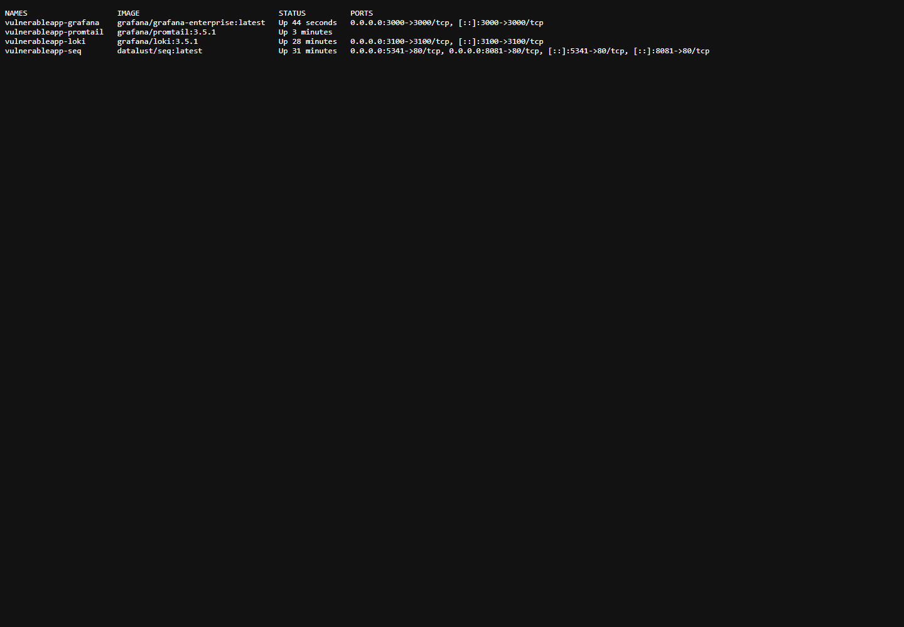
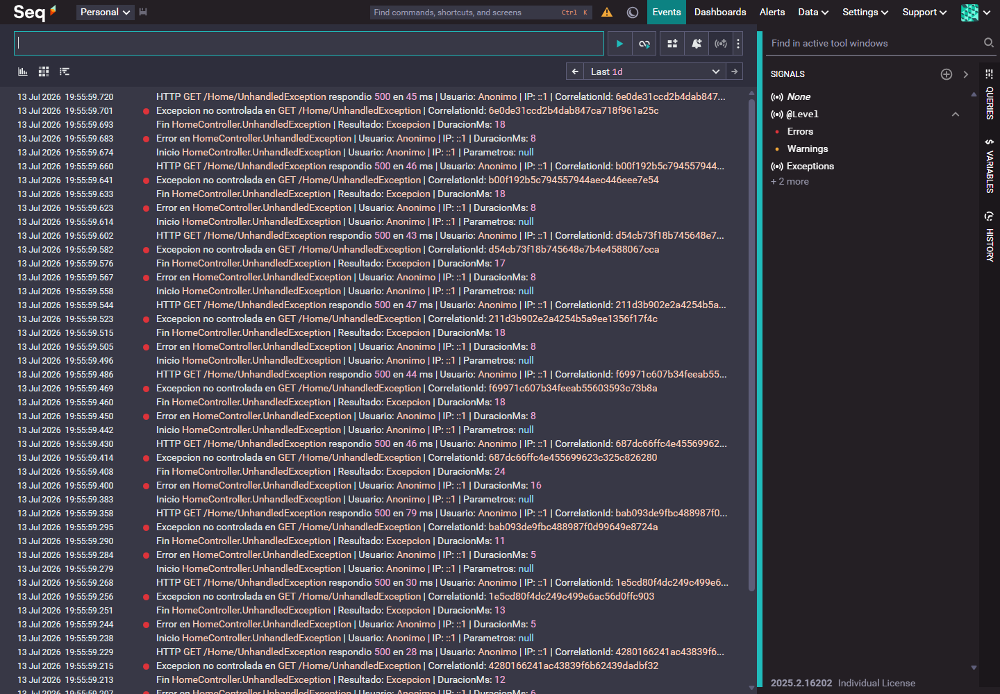
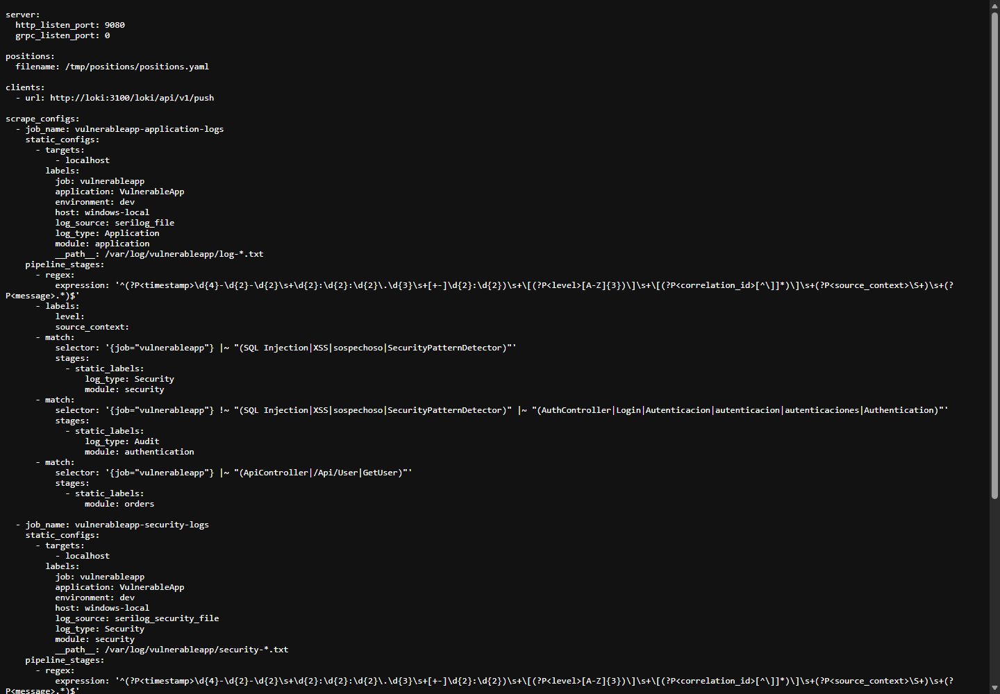
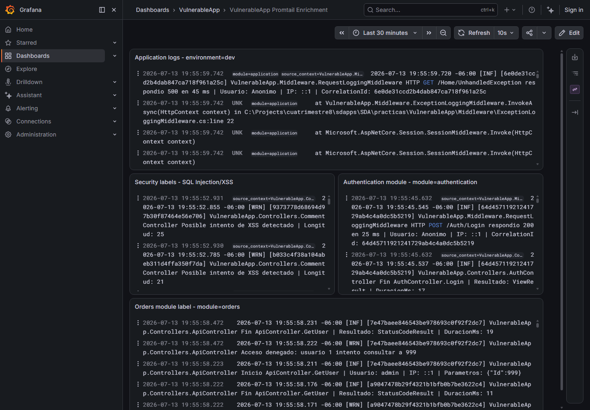
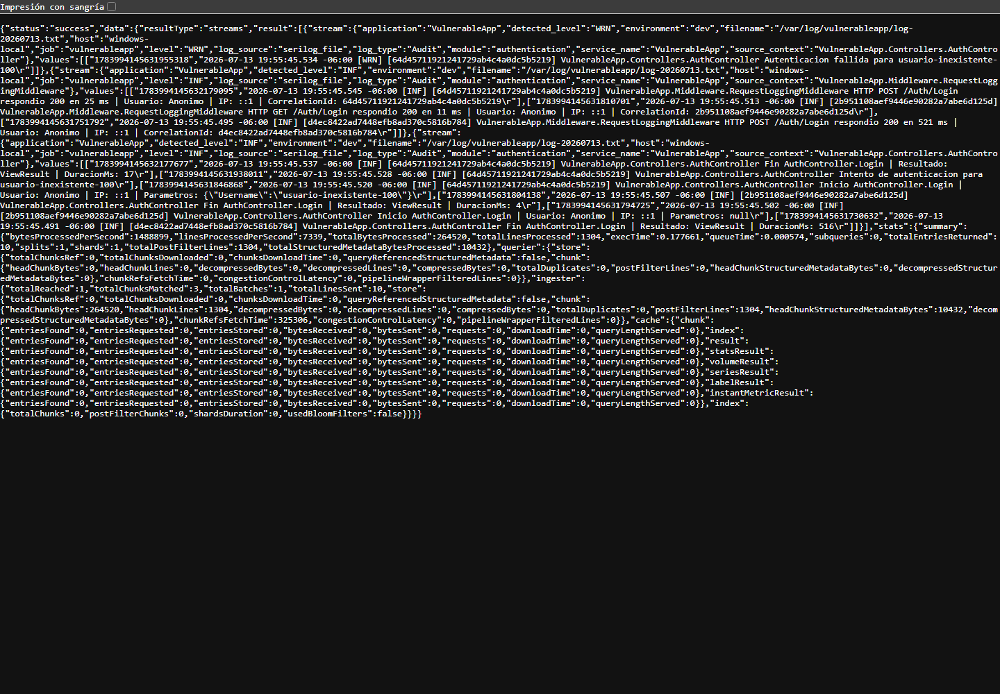
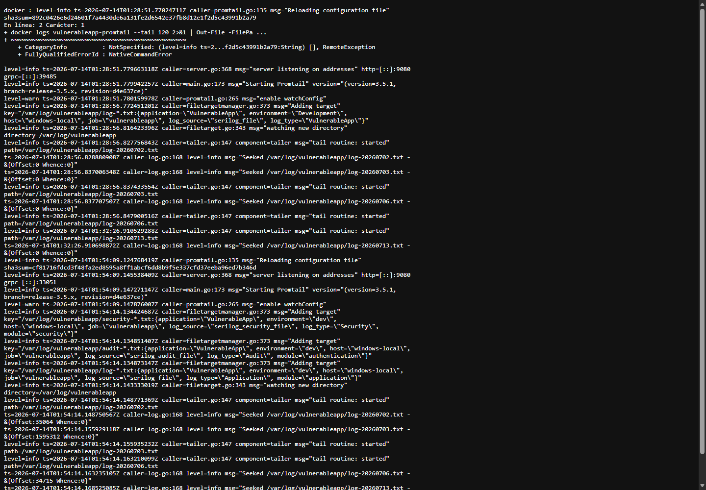

# SEGG-U2-P4H-2 - Integración y Enriquecimiento de Registros con Promtail y Loki

## Datos generales

- Proyecto trabajado: `VulnerableApp`
- Práctica: `SEGG-U2-P4H-2`
- Fecha de ejecución: 2026-07-13
- Plataforma: VulnerableApp local + Serilog + Seq + Promtail + Loki + Grafana
- Restricción respetada: no se modificó la lógica de negocio de la aplicación.

## Objetivo

Configurar Promtail para recolectar y enriquecer los archivos de registro generados por `VulnerableApp`, enviarlos a Loki y validar que los mismos eventos puedan consultarse desde Seq y Grafana.

## 1. Verificación de infraestructura existente

Se validó que la plataforma creada en P4H-1 continúa activa:

- Seq: `http://127.0.0.1:8081`
- Loki: `http://127.0.0.1:3100`
- Grafana: `http://127.0.0.1:3000`
- Promtail: contenedor `vulnerableapp-promtail`
- VulnerableApp: `http://localhost:5088`

Comandos usados:

```powershell
docker ps --filter "name=vulnerableapp"
Invoke-WebRequest -Uri http://127.0.0.1:3100/ready -UseBasicParsing
Invoke-WebRequest -Uri http://127.0.0.1:3000/api/health -UseBasicParsing
```

Resultado:

- Contenedores activos: Seq, Loki, Promtail y Grafana.
- Loki respondió `200 ready`.
- Grafana respondió `database: ok`.
- VulnerableApp siguió generando registros en consola, archivos y Seq.

## 2. Análisis del archivo de configuración de Promtail

Archivo analizado y actualizado:

```text
seq-infra/promtail/config.yml
```

| Sección | Finalidad |
|---|---|
| `server` | Define los puertos internos usados por Promtail para exponer su servidor HTTP y gRPC. En esta práctica se usa `http_listen_port: 9080` y `grpc_listen_port: 0`. |
| `clients` | Indica a dónde enviará Promtail los registros recolectados. Aquí apunta a Loki con `http://loki:3100/loki/api/v1/push`. |
| `positions` | Define el archivo donde Promtail guarda el avance de lectura de cada archivo. Se usa `/tmp/positions/positions.yaml`. |
| `scrape_configs` | Contiene los trabajos de recolección. Cada job define qué archivos leer, con qué labels y qué pipeline aplicar. |
| `static_configs` | Define targets estáticos y labels base para cada patrón de archivos. |
| `labels` | Añade metadatos consultables por Loki/LogQL, por ejemplo `application`, `environment`, `log_type` y `module`. |
| `pipeline_stages` | Procesa cada línea leída. En esta práctica extrae campos con regex y agrega labels condicionales con `match` y `static_labels`. |

## 3. Monitoreo de múltiples archivos

Promtail fue configurado para monitorear más de un patrón de archivos dentro del bind mount:

```yaml
__path__: /var/log/vulnerableapp/log-*.txt
__path__: /var/log/vulnerableapp/security-*.txt
__path__: /var/log/vulnerableapp/audit-*.txt
```

La carpeta local compartida con el contenedor es:

```text
C:\Projects\cuatrimestre8\sdapps\SDA\practicas\VulnerableApp\Logs
```

Dentro del contenedor Promtail se monta como:

```text
/var/log/vulnerableapp
```

Promtail requiere conocer la ubicación física de los archivos porque trabaja como agente de lectura: necesita abrir archivos reales del sistema de archivos, seguir su crecimiento y recordar el avance de lectura mediante `positions.yaml`.

## 4. Enriquecimiento mediante labels

Se agregaron labels para clasificar los registros sin modificar la aplicación:

| Label | Valor usado | Qué identifica |
|---|---|---|
| `application` | `VulnerableApp` | Aplicación origen del registro. |
| `environment` | `dev` | Ambiente de ejecución local/desarrollo. |
| `log_type` | `Application` | Eventos generales de aplicación. |
| `log_type` | `Security` | Eventos de seguridad, por ejemplo SQL Injection y XSS. |
| `log_type` | `Audit` | Eventos relacionados con autenticación. |
| `module` | `application` | Flujo general de la app. |
| `module` | `security` | Eventos sospechosos o de seguridad. |
| `module` | `authentication` | Eventos de login/autenticación. |
| `module` | `orders` | Eventos asociados al endpoint API usado como módulo de ejemplo. |
| `level` | `INF`, `WRN`, `ERR` | Nivel de severidad extraído del log de Serilog. |
| `source_context` | Nombre de clase/controlador | Contexto origen del evento. |

Ventajas frente a búsqueda textual:

- Permiten filtrar streams de Loki sin depender de palabras exactas dentro del mensaje.
- Reducen ruido durante análisis de incidentes.
- Hacen más claros los dashboards.
- Permiten consultas LogQL como `{module="authentication"}`.
- Evitan recorrer manualmente eventos no relacionados.

## 5. Aplicación de configuración

Se reinició únicamente Promtail:

```powershell
docker compose -f seq-infra\docker-compose.yml restart promtail
```

Validación posterior:

```powershell
docker logs vulnerableapp-promtail --tail 120
```

Promtail cargó los tres patrones:

- `/var/log/vulnerableapp/log-*.txt`
- `/var/log/vulnerableapp/security-*.txt`
- `/var/log/vulnerableapp/audit-*.txt`

También confirmó lectura con offsets previos desde `positions.yaml`, evitando reenviar archivos completos.

## 6. Actividad generada en VulnerableApp

Se ejecutó el script de carga existente:

```powershell
$env:P3G_TEST_PASSWORD = "Admin#2026!"
.\VulnerableApp\scripts\run-p3g-observability-load.ps1
.\VulnerableApp\scripts\analyze-p3g-logs.ps1
```

Resultados:

- TestRunId: `P3G-20260713-195444`
- CorrelationId faltantes: `0`
- Respuestas inesperadas: `0`
- Líneas analizadas: `3730`
- Information: `3499`
- Warning: `211`
- Error: `20`
- Intentos SQL Injection: `30`
- Intentos XSS: `30`
- Autenticaciones fallidas: `100`
- Excepciones controladas: `20`
- Excepciones no controladas: `10`

## 7. Validación desde Grafana y Loki

Se creó el dashboard:

```text
seq-infra/grafana/dashboards/vulnerableapp-promtail-enrichment.json
```

Dashboard:

```text
VulnerableApp Promtail Enrichment
```

Consultas LogQL validadas:

```logql
{application="VulnerableApp", environment="dev", log_type="Application"}
```

```logql
{application="VulnerableApp", environment="dev", log_type="Security", module="security"}
```

```logql
{application="VulnerableApp", environment="dev", log_type="Audit", module="authentication"}
```

```logql
{application="VulnerableApp", environment="dev", module="orders"}
```

La consulta del reto fue:

```logql
{application="VulnerableApp", environment="dev", module="authentication"}
```

Esta consulta devolvió eventos relacionados con `AuthController`, login y autenticación.

## 8. Comparación Seq vs Grafana + Loki

| Característica | Seq | Grafana + Loki |
|---|---|---|
| Búsqueda textual | Muy cómoda para buscar mensajes y propiedades emitidas por Serilog. | Permite búsqueda textual, pero su mayor fortaleza es combinar filtros de labels con expresiones LogQL. |
| Filtros por labels | Seq trabaja mejor con propiedades estructuradas de eventos. | Loki se basa en labels para seleccionar streams, por ejemplo `module="authentication"`. |
| Dashboards | Tiene vistas y señales útiles, pero está más orientado al análisis de eventos. | Grafana sobresale en dashboards, paneles, visualización y monitoreo continuo. |
| Consultas avanzadas | Tiene sintaxis propia, buena para inspeccionar eventos individuales. | LogQL permite filtros, rangos, agregaciones y separación por labels. |
| Escalabilidad | Muy práctico para aplicaciones .NET y análisis local/centralizado de eventos. | Loki está diseñado para agregación de logs a escala usando labels e índices eficientes. |
| Uso principal | Depuración y análisis estructurado de logs de aplicación. | Observabilidad operacional, dashboards, correlación y consultas por labels. |

## 9. Pregunta de reflexión

¿Qué ocurriría si Promtail no almacenara la posición del último registro leído en `positions.yaml`?

Promtail perdería el control del avance de lectura por archivo. Al reiniciarse, podría volver a leer registros ya enviados o saltar información dependiendo del modo en que el archivo sea detectado. En una plataforma de observabilidad esto causaría problemas como:

- Duplicación de eventos en Loki.
- Métricas y conteos incorrectos.
- Mayor consumo de red y almacenamiento.
- Dificultad para distinguir eventos nuevos de eventos reenviados.
- Ruido en dashboards y consultas.

`positions.yaml` es necesario para mantener continuidad de recolección y evitar reprocesamiento innecesario.

## 10. Reto: labels adicionales

Se configuraron las labels solicitadas:

```yaml
environment: dev
module: authentication
module: orders
```

Procedimiento:

1. Se agregó `environment: dev` en todos los jobs de Promtail.
2. Se agregó `module: application` para registros generales.
3. Se usó `match` + `static_labels` para cambiar a `module: authentication` cuando el mensaje pertenece a `AuthController`, `Login` o autenticación.
4. Se usó `match` + `static_labels` para marcar `module: orders` en eventos de `ApiController`, `/Api/User` o `GetUser`.
5. Se validó en Grafana con la consulta:

```logql
{application="VulnerableApp", environment="dev", module="authentication"}
```

## 11. Evidencias generadas

| Evidencia solicitada | Archivo |
|---|---|
| Archivo Promtail actualizado | `seq-infra/promtail/config.yml` y `VulnerableApp/evidencias/P4H-2/promtail-config.yml` |
| Tabla con descripción de configuración | Este reporte, sección 2 |
| Captura de docker ps | `VulnerableApp/evidencias/P4H-2/01-docker-ps.png` |
| Captura de Seq | `VulnerableApp/evidencias/P4H-2/02-seq-eventos.png` |
| Captura de Grafana por labels | `VulnerableApp/evidencias/P4H-2/04-grafana-promtail-labels-dashboard.png` |
| Consulta módulo Authentication | `VulnerableApp/evidencias/P4H-2/05-loki-module-authentication-query.png` |
| Evidencia de reinicio de Promtail | `VulnerableApp/evidencias/P4H-2/06-promtail-restart-logs.png` |
| Conclusiones del análisis comparativo | Este reporte, secciones 8 y 12 |

## 12. Evidencias visuales

### docker ps



### Seq mostrando eventos



### Promtail actualizado



### Grafana mostrando consultas por labels



### Consulta `module=authentication`



### Logs de reinicio de Promtail



## 13. Conclusiones

La práctica P4H-2 quedó implementada ampliando Promtail sin modificar la lógica de negocio de `VulnerableApp`. La configuración ahora soporta múltiples patrones de archivos (`log-*.txt`, `security-*.txt` y `audit-*.txt`) y enriquece eventos con labels consultables en Loki.

Grafana permite validar visualmente los eventos por `environment`, `log_type` y `module`. Seq sigue siendo útil para inspección directa de eventos estructurados, mientras que Grafana + Loki ofrece una vista más operacional, especialmente para dashboards y consultas por labels.

La label `module=authentication` permitió resolver el reto solicitado, filtrando únicamente eventos relacionados con autenticación desde Grafana/LogQL.

## Referencias

- Grafana Labs. Configure Promtail: https://grafana.com/docs/loki/latest/send-data/promtail/configuration/
- Grafana Labs. Query Loki / LogQL: https://grafana.com/docs/loki/latest/query/
- Grafana Labs. Promtail `static_labels` stage: https://grafana.com/docs/loki/latest/send-data/promtail/stages/static_labels/
