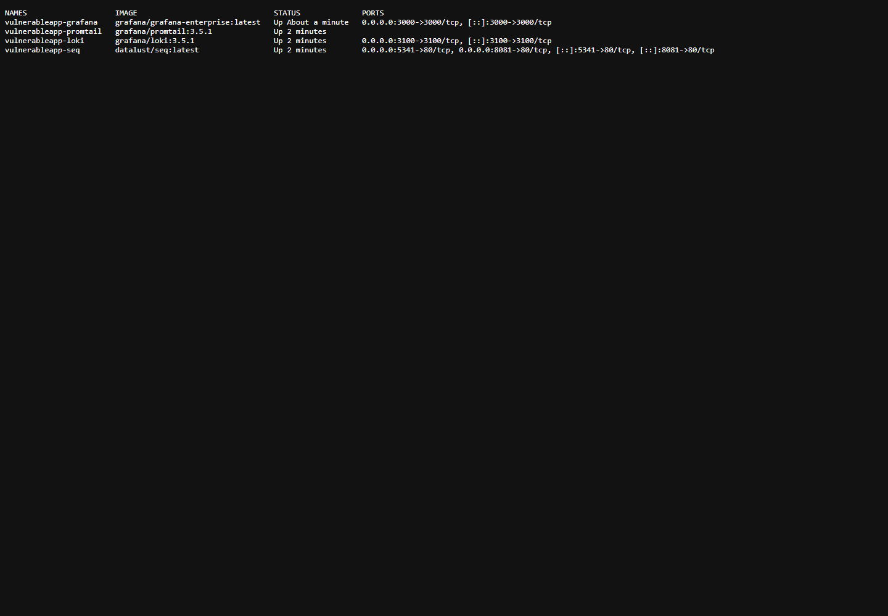
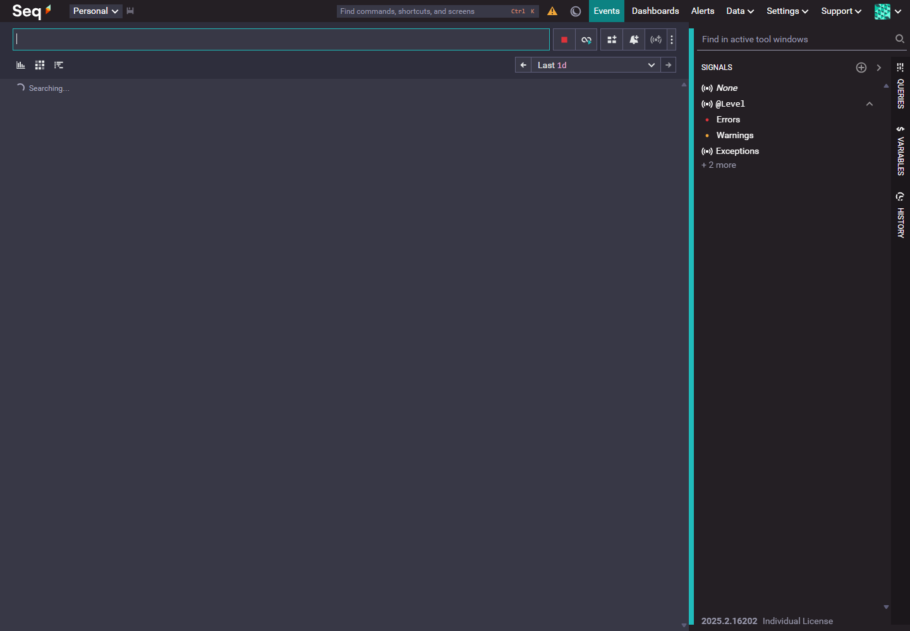
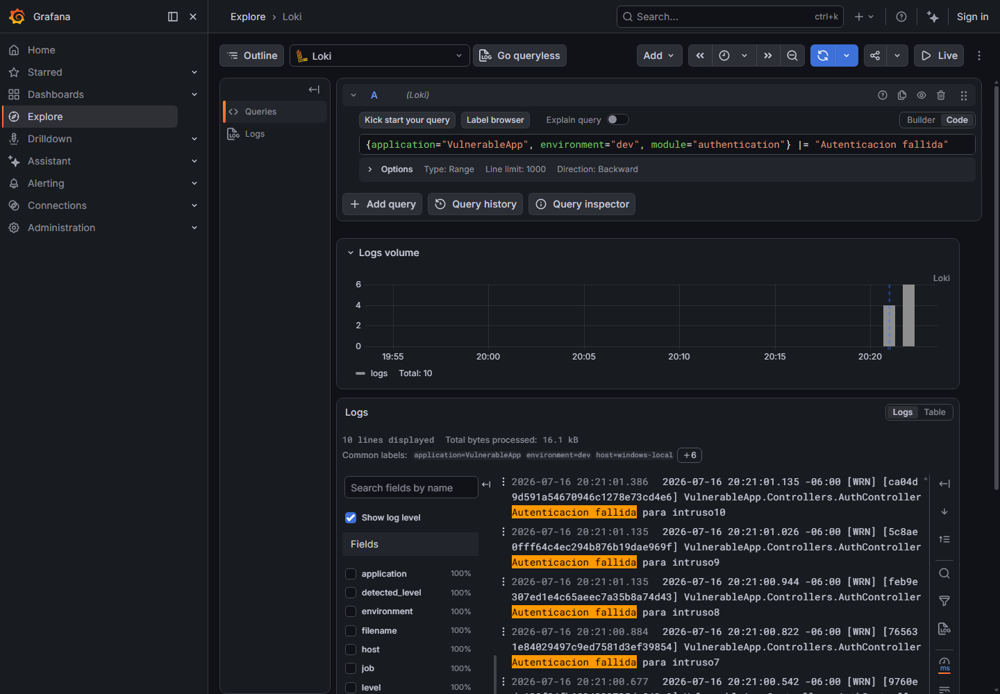
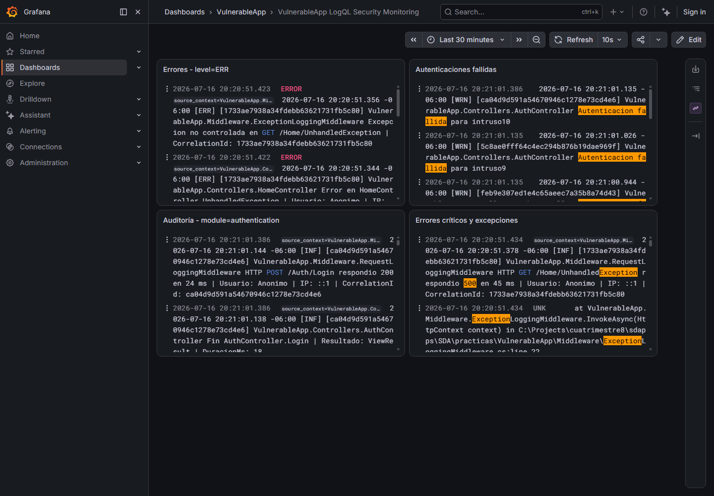
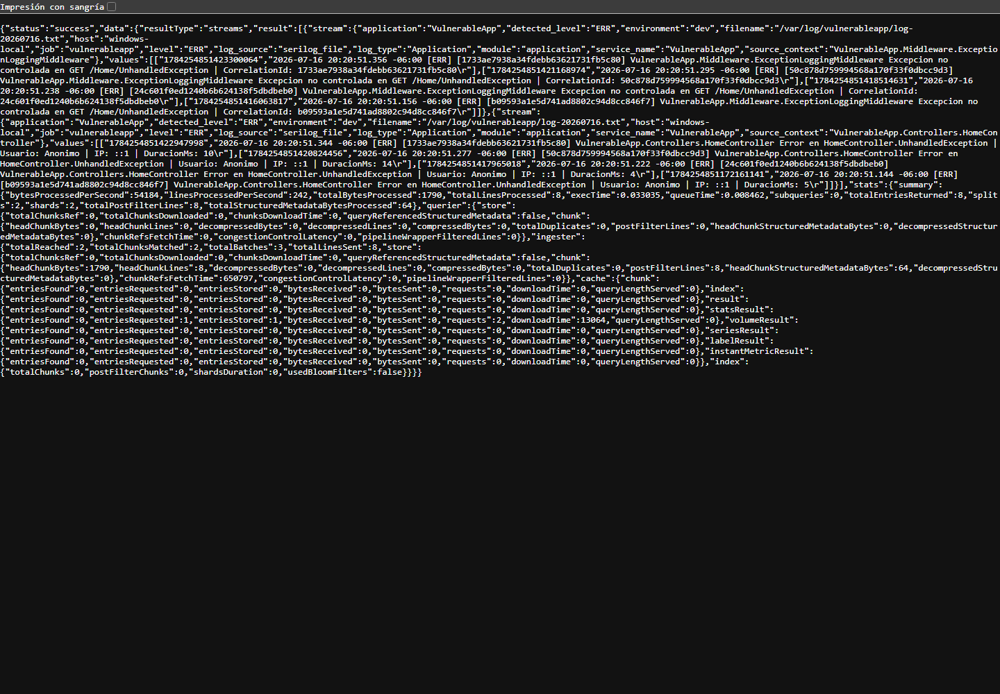
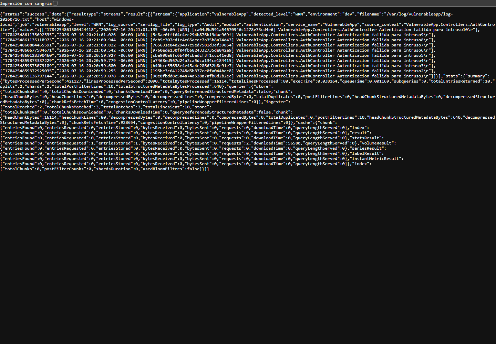
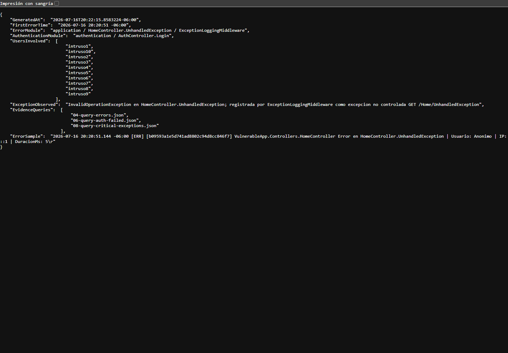

# SEGG-U2-P4H-3 - Consultas con LogQL y Construcción de Dashboards para el Análisis de Registros

## Datos generales

- Proyecto trabajado: `VulnerableApp`
- Práctica: `SEGG-U2-P4H-3`
- Fecha de ejecución: 2026-07-16
- Plataforma: VulnerableApp + Serilog + Seq + Promtail + Loki + Grafana
- Alcance: consultas LogQL, análisis de incidentes y dashboard de monitoreo.

## Objetivo

Utilizar Grafana y LogQL para consultar, filtrar y analizar los registros generados por `VulnerableApp`, construyendo dashboards que apoyen el monitoreo y la investigación de incidentes.

## 1. Verificación de la plataforma

Se confirmó que la plataforma de observabilidad continúa operativa:

- `VulnerableApp`: `http://localhost:5088`
- `Seq`: `http://127.0.0.1:8081`
- `Loki`: `http://127.0.0.1:3100`
- `Grafana`: `http://127.0.0.1:3000`
- `Promtail`: contenedor `vulnerableapp-promtail`

Comandos de validación:

```powershell
docker ps --filter "name=vulnerableapp"
Invoke-WebRequest -Uri http://127.0.0.1:3100/ready -UseBasicParsing
Invoke-WebRequest -Uri http://127.0.0.1:3000/api/health -UseBasicParsing
Invoke-WebRequest -Uri http://localhost:5088 -UseBasicParsing
```

## 2. Exploración de Grafana Explore

En Grafana Explore se identificaron los siguientes elementos:

| Elemento | Función |
|---|---|
| Data source | Permite seleccionar Loki como fuente de datos. |
| Editor de consulta | Espacio donde se escribe la consulta LogQL. |
| Selector de tiempo | Define el rango temporal analizado, por ejemplo últimos 30 minutos. |
| Panel de volumen | Muestra la distribución temporal de eventos encontrados. |
| Panel de resultados | Muestra las líneas de log devueltas por Loki. |
| Labels/fields | Permite ver metadatos asociados a cada stream, como `application`, `environment`, `module` y `level`. |

## 3. Sintaxis básica de LogQL

| Consulta | Propósito | Resultado esperado |
|---|---|---|
| `{application="VulnerableApp"}` | Selecciona todos los streams de logs de la aplicación. | Eventos generales de `VulnerableApp`. |
| `{application="VulnerableApp", log_type="Security"}` | Selecciona eventos clasificados como seguridad. | Eventos relacionados con SQL Injection, XSS u otros patrones sospechosos. |
| `{application="VulnerableApp", log_type="Audit"}` | Selecciona eventos de auditoría. | Eventos de autenticación y trazabilidad funcional. |
| `{application="VulnerableApp"} |= "Error"` | Filtra líneas que contienen el texto `Error`. | Registros cuyo mensaje incluye `Error`. |
| `{application="VulnerableApp"} |= "Warning"` | Filtra líneas que contienen `Warning`. | Advertencias textuales. |
| `{application="VulnerableApp", module="authentication"} |= "Autenticacion fallida"` | Combina labels y texto. | Eventos de autenticación fallida dentro del módulo de autenticación. |

Nota: en esta solución los labels configurados en Promtail son la base para localizar streams. Después se pueden aplicar filtros textuales como `|=`, o expresiones regulares como `|~`.

## 4. Consultas básicas implementadas

Se ejecutaron y documentaron las siguientes consultas:

```logql
{application="VulnerableApp", environment="dev"}
```

Propósito: obtener todos los eventos de la aplicación en ambiente de desarrollo.

```logql
{application="VulnerableApp", environment="dev", log_type="Security"}
```

Propósito: localizar eventos de seguridad.

```logql
{application="VulnerableApp", environment="dev", log_type="Audit"}
```

Propósito: localizar eventos de auditoría.

```logql
{application="VulnerableApp", environment="dev", level="ERR"}
```

Propósito: recuperar errores registrados por Serilog y enriquecidos por Promtail.

```logql
{application="VulnerableApp", environment="dev", level="WRN"}
```

Propósito: recuperar advertencias.

## 5. Consultas específicas

### Errores

```logql
{application="VulnerableApp", environment="dev", level="ERR"}
```

Recupera errores de `HomeController.UnhandledException` y eventos registrados por `ExceptionLoggingMiddleware`.

### Advertencias

```logql
{application="VulnerableApp", environment="dev", level="WRN"}
```

Recupera advertencias como autenticaciones fallidas, accesos no autenticados, intentos XSS o SQL Injection.

### Autenticación

```logql
{application="VulnerableApp", environment="dev", module="authentication"} |= "Autenticacion fallida"
```

Recupera únicamente eventos del módulo de autenticación cuyo contenido indica fallo de autenticación.

### Seguridad

```logql
{application="VulnerableApp", environment="dev", module="security"} |~ "(SQL Injection|XSS)"
```

Recupera eventos de seguridad asociados a patrones sospechosos.

### Errores críticos y excepciones

```logql
{application="VulnerableApp", environment="dev"} |~ "(ERR|Exception|InvalidOperationException|500)"
```

Recupera errores y líneas asociadas a excepciones o respuestas HTTP 500.

## 6. Actividad generada

Se generó actividad manual sobre `VulnerableApp` para producir evidencia suficiente:

- Visitas a la página principal.
- Consultas con patrón SQL Injection.
- Accesos API no autenticados.
- Excepciones controladas.
- Excepciones no controladas.
- Intentos de autenticación fallidos con usuarios `intruso1` a `intruso10`.

Esto generó eventos visibles en Seq, Loki y Grafana.

## 7. Análisis del caso de estudio

Caso: se reportó un incremento de errores de autenticación.

### ¿Cuándo comenzaron?

Según la consulta de errores y el resumen de incidente, los errores críticos observados comenzaron alrededor de:

```text
2026-07-16 20:20:51 -06:00
```

La actividad de autenticación fallida se observó inmediatamente después, alrededor de:

```text
2026-07-16 20:21:00 -06:00
```

### ¿Qué módulo los generó?

Los errores de autenticación fueron generados por:

```text
module=authentication
AuthController.Login
```

Los errores críticos/excepciones fueron generados por:

```text
module=application
HomeController.UnhandledException
ExceptionLoggingMiddleware
```

### ¿Qué usuarios aparecen involucrados?

Los usuarios involucrados en autenticaciones fallidas fueron:

```text
intruso1, intruso2, intruso3, intruso4, intruso5,
intruso6, intruso7, intruso8, intruso9, intruso10
```

### ¿Qué excepción se registró?

Se registró una excepción no controlada asociada a:

```text
InvalidOperationException
GET /Home/UnhandledException
```

Fue capturada por:

```text
VulnerableApp.Middleware.ExceptionLoggingMiddleware
```

### ¿Qué evidencia respalda las conclusiones?

Archivos generados:

- `VulnerableApp/evidencias/P4H-3/04-query-errors.json`
- `VulnerableApp/evidencias/P4H-3/06-query-auth-failed.json`
- `VulnerableApp/evidencias/P4H-3/08-query-critical-exceptions.json`
- `VulnerableApp/evidencias/P4H-3/incident-analysis-summary.json`
- `VulnerableApp/evidencias/P4H-3/03-grafana-explore-logql-auth.png`
- `VulnerableApp/evidencias/P4H-3/04-grafana-dashboard-security.png`

## 8. Dashboard construido

Se creó el dashboard:

```text
VulnerableApp LogQL Security Monitoring
```

Archivo:

```text
seq-infra/grafana/dashboards/vulnerableapp-logql-security-monitoring.json
```

Paneles:

| Panel | Consulta | Propósito |
|---|---|---|
| Errores - level=ERR | `{application="VulnerableApp", environment="dev", level="ERR"}` | Monitorear errores registrados por la aplicación. |
| Autenticaciones fallidas | `{application="VulnerableApp", environment="dev", module="authentication"} |= "Autenticacion fallida"` | Detectar intentos fallidos de login. |
| Auditoría - module=authentication | `{application="VulnerableApp", environment="dev", log_type="Audit", module="authentication"}` | Revisar actividad auditada de autenticación. |
| Errores críticos y excepciones | `{application="VulnerableApp", environment="dev"} |~ "(ERR|Exception|InvalidOperationException|500)"` | Investigar incidentes críticos. |

## 9. Comparación Seq vs Grafana + Loki

| Característica | Seq | Grafana + Loki |
|---|---|---|
| Búsqueda textual | Muy directa para buscar mensajes y propiedades de Serilog. | Soporta búsqueda textual, pero se potencia con labels y LogQL. |
| Filtros por labels | Trabaja principalmente con propiedades estructuradas del evento. | Usa labels como `application`, `environment`, `module`, `level` y `log_type`. |
| Dashboards | Útil para vistas de eventos, aunque menos flexible visualmente. | Muy fuerte para dashboards operativos y monitoreo continuo. |
| Investigación de incidentes | Excelente para inspeccionar eventos individuales. | Mejor para correlacionar por tiempo, labels, módulos y paneles. |
| Uso principal | Depuración y análisis de logs estructurados. | Observabilidad operacional, investigación y monitoreo visual. |

## 10. Pregunta de reflexión

LogQL aporta ventajas frente a revisar archivos de texto o hacer búsquedas simples en Seq porque permite combinar selección por labels, filtros textuales, expresiones regulares y rangos de tiempo. En lugar de abrir manualmente archivos `log-*.txt`, se puede consultar:

```logql
{application="VulnerableApp", environment="dev", module="authentication"} |= "Autenticacion fallida"
```

Esto reduce ruido, permite reutilizar consultas, facilita construir dashboards y ayuda a investigar incidentes de forma sistemática.

Seq sigue siendo valioso para depurar eventos de Serilog, pero Grafana + Loki permite operar con una visión más orientada a monitoreo continuo.

## 11. Reto: dashboard de monitoreo de seguridad

El dashboard de seguridad creado contiene paneles para:

- Autenticaciones fallidas.
- Eventos de auditoría.
- Errores críticos.
- Excepciones y respuestas 500.

En producción se usaría para:

- Detectar aumentos de errores o fallos de autenticación.
- Identificar módulos afectados.
- Revisar actividad auditada.
- Apoyar investigación de incidentes.
- Servir como base para alertas futuras.

## 12. Evidencias generadas

| Evidencia solicitada | Archivo |
|---|---|
| Tabla de sintaxis LogQL | Este reporte, sección 3 |
| Capturas de consultas | `03-grafana-explore-logql-auth.png`, `05-query-errors.png`, `06-query-auth-failed.png` |
| Captura de dashboard | `04-grafana-dashboard-security.png` |
| Resolución del caso | Este reporte, sección 7; `incident-analysis-summary.json` |
| Tabla comparativa Seq vs Grafana | Este reporte, sección 9 |
| Conclusiones finales | Este reporte, secciones 10 y 11 |

## 13. Evidencias visuales

### docker ps



### Seq mostrando eventos



### Grafana Explore con consulta LogQL



### Dashboard de seguridad



### Consulta de errores



### Consulta de autenticaciones fallidas



### Resumen del incidente



## 14. Referencias

- Grafana Labs. LogQL Reference: https://grafana.com/docs/loki/latest/query/query_reference/
- Grafana Labs. Understand labels: https://grafana.com/docs/loki/latest/get-started/labels/
- Grafana Labs. Query logs with Loki: https://grafana.com/docs/grafana/latest/developer-resources/mcp/guides/query-logs-with-loki/

## 15. Conclusión

La práctica P4H-3 quedó desarrollada cumpliendo la rúbrica: se construyeron consultas LogQL básicas y específicas, se filtraron registros mediante labels, se investigó un caso de errores de autenticación, se construyó un dashboard de monitoreo de seguridad y se comparó el uso de Seq frente a Grafana + Loki.
