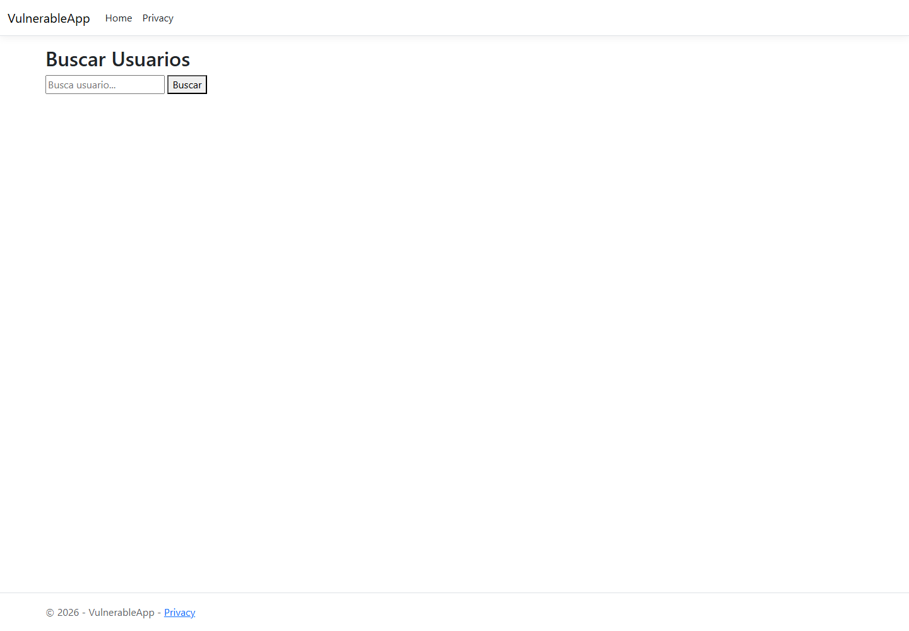
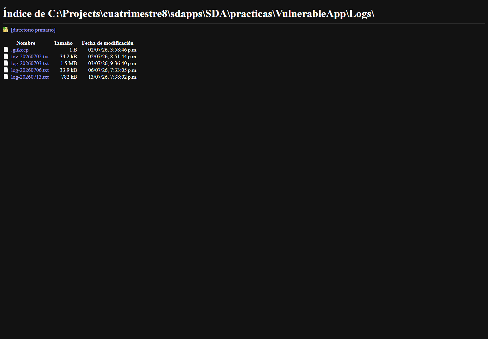
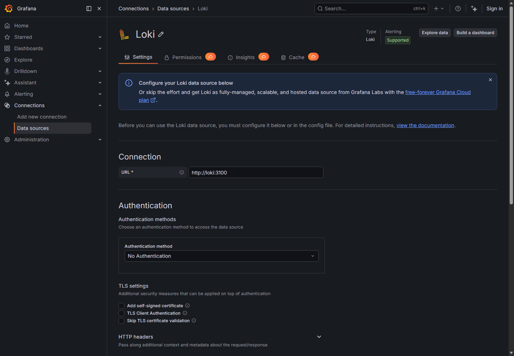
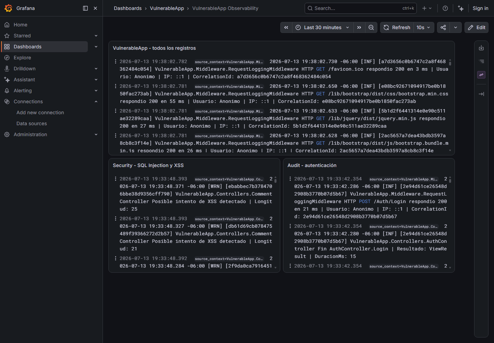
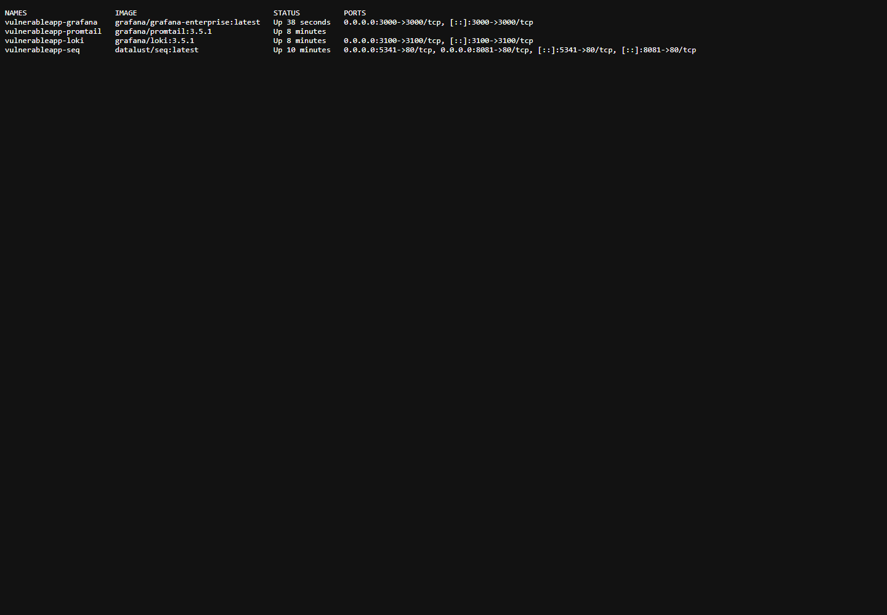
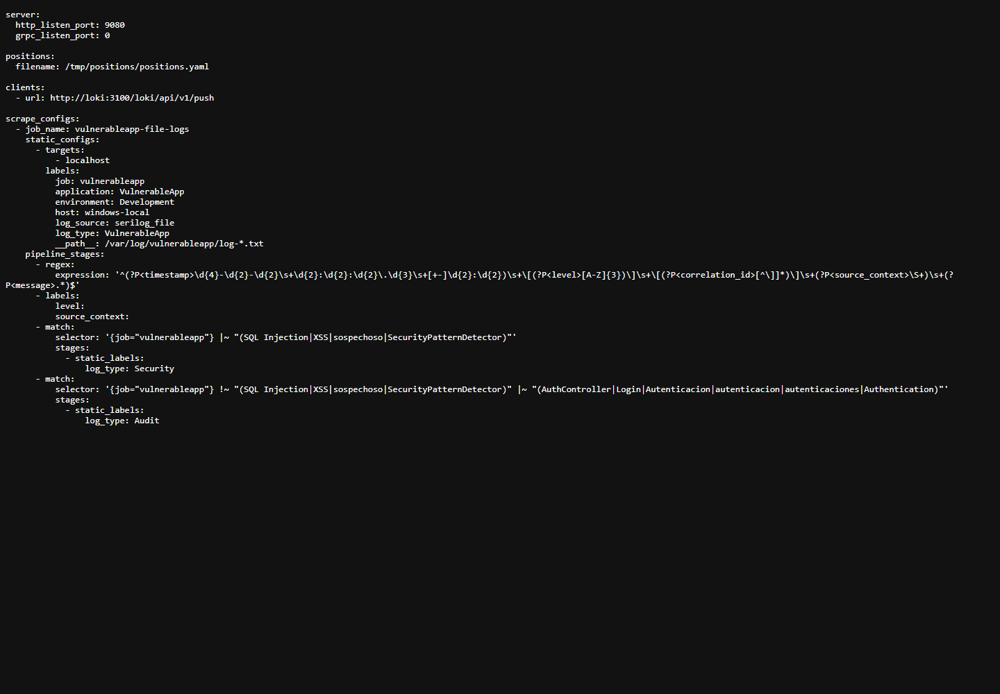
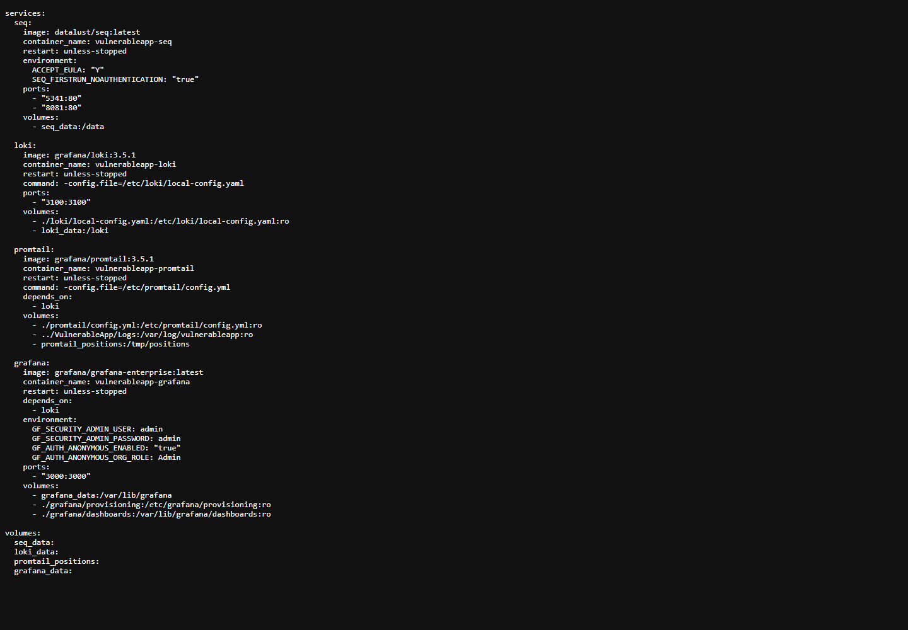

# SEGG-U2-P4H-1 - Implementación de una Plataforma de Observabilidad con Grafana, Loki y Promtail

## Datos generales

- Proyecto trabajado: `VulnerableApp`
- Aplicación observada: ASP.NET Core MVC con Serilog
- Infraestructura agregada: Grafana, Loki y Promtail
- Fecha de ejecución: 2026-07-13
- Entorno: desarrollo local

## Objetivo

Extender la solución de logging previamente implementada en `VulnerableApp` incorporando una plataforma de observabilidad basada en Grafana, Loki y Promtail. La aplicación no fue contenida en Docker; continúa ejecutándose localmente con `dotnet run`. Docker aloja únicamente Seq, Grafana, Loki y Promtail.

## Arquitectura implementada

```text
VulnerableApp (.NET + Serilog)
        |
        |-- Consola
        |-- Archivo local: VulnerableApp/Logs/log-*.txt
        |-- Seq: http://localhost:8081
        |
        | bind mount
        v
Promtail -> Loki -> Grafana
```

## Verificación de la solución existente

Se verificó que `VulnerableApp` sigue generando registros mediante Serilog en:

- Consola.
- Archivos locales en `VulnerableApp/Logs/log-*.txt`.
- Seq en `http://localhost:8081`.

La aplicación se ejecutó localmente en:

```text
http://localhost:5088
```

El script de carga generó actividad real sobre la aplicación:

```powershell
$env:P3G_TEST_PASSWORD = "Admin#2026!"
.\VulnerableApp\scripts\run-p3g-observability-load.ps1
.\VulnerableApp\scripts\analyze-p3g-logs.ps1
```

Resultado de la ejecución:

- TestRunId: `P3G-20260713-193232`
- CorrelationId faltantes: `0`
- Respuestas inesperadas: `0`
- Líneas analizadas: `3730`
- Eventos Information: `3499`
- Eventos Warning: `211`
- Eventos Error: `20`
- Intentos SQL Injection: `30`
- Intentos XSS: `30`
- Autenticaciones fallidas: `100`
- Excepciones controladas: `20`
- Excepciones no controladas: `10`

## Infraestructura agregada

Se extendió el archivo existente:

```text
seq-infra/docker-compose.yml
```

Servicios agregados:

| Servicio | Imagen | Puerto | Uso |
|---|---|---:|---|
| Loki | `grafana/loki:3.5.1` | `3100` | Almacenamiento y consulta de logs |
| Promtail | `grafana/promtail:3.5.1` | interno | Recolección de logs desde archivos |
| Grafana | `grafana/grafana-enterprise:latest` | `3000` | Visualización, dashboard y consultas |

Se mantuvo Seq como servicio existente:

| Servicio | Imagen | Puerto |
|---|---|---:|
| Seq | `datalust/seq:latest` | `8081`, `5341` |

## Bind mount de logs

Promtail accede a los logs locales mediante el siguiente bind mount:

```yaml
- ../VulnerableApp/Logs:/var/log/vulnerableapp:ro
```

La ruta del host es:

```text
C:\Projects\cuatrimestre8\sdapps\SDA\practicas\VulnerableApp\Logs
```

La ruta dentro del contenedor es:

```text
/var/log/vulnerableapp
```

El montaje es de solo lectura (`ro`) porque Promtail únicamente necesita leer los archivos generados por Serilog. Esto evita modificar la aplicación y cumple con la restricción de no contenerizar `VulnerableApp`.

## Configuración de Loki

Archivo:

```text
seq-infra/loki/local-config.yaml
```

Loki se configuró en modo local con almacenamiento filesystem y esquema TSDB:

- `auth_enabled: false`
- Puerto HTTP: `3100`
- Almacenamiento: `/loki`
- Esquema: `v13`
- Índices diarios

Validación:

```powershell
Invoke-WebRequest -Uri http://127.0.0.1:3100/ready -UseBasicParsing
```

Resultado:

```text
200 ready
```

## Configuración de Promtail

Archivo:

```text
seq-infra/promtail/config.yml
```

Promtail monitorea:

```yaml
__path__: /var/log/vulnerableapp/log-*.txt
```

También utiliza:

```yaml
positions:
  filename: /tmp/positions/positions.yaml
```

`positions.yaml` permite que Promtail recuerde hasta qué byte leyó cada archivo. Esto evita reenviar todos los logs cada vez que el contenedor se reinicia.

## Labels configuradas

Labels base:

```yaml
job: vulnerableapp
application: VulnerableApp
environment: Development
host: windows-local
log_source: serilog_file
log_type: VulnerableApp
```

Labels extraídas por regex:

```yaml
level
source_context
```

No se promovió `CorrelationId` a label para evitar alta cardinalidad. El `CorrelationId` permanece dentro del mensaje del log y puede buscarse textualmente cuando sea necesario.

## Reto: diferenciación VulnerableApp, Security y Audit

Promtail se configuró con `pipeline_stages` y `match` para clasificar registros:

- `log_type=VulnerableApp`: valor base para logs generales.
- `log_type=Security`: eventos que contienen patrones como `SQL Injection`, `XSS`, `sospechoso` o `SecurityPatternDetector`.
- `log_type=Audit`: eventos relacionados con autenticación, `AuthController` o `Login`.

Consultas LogQL usadas:

```logql
{job="vulnerableapp"}
```

```logql
{job="vulnerableapp", log_type="Security"}
```

```logql
{job="vulnerableapp", log_type="Audit"}
```

## Respuestas del reto

### ¿Qué modificaciones se realizaron en Promtail?

Se configuró Promtail para leer los archivos `log-*.txt` generados por Serilog desde un bind mount de solo lectura. También se agregó un pipeline con:

- `regex` para extraer nivel y contexto fuente.
- `labels` para promover `level` y `source_context`.
- `match` y `static_labels` para clasificar eventos como `Security` o `Audit`.

### ¿Cómo utiliza Loki las labels?

Loki indexa los logs principalmente mediante labels. En lugar de indexar todo el contenido del mensaje, Loki usa combinaciones de labels para localizar streams de logs. Por ejemplo:

```logql
{application="VulnerableApp", log_type="Security"}
```

Esta consulta selecciona únicamente los streams que tienen esas labels.

### ¿Qué ventajas ofrecen las labels para consultas LogQL?

Las labels permiten:

- Filtrar rápidamente por aplicación, ambiente, fuente o tipo de evento.
- Separar eventos generales, de seguridad y auditoría.
- Construir dashboards más claros.
- Reducir ruido al analizar incidentes.
- Consultar eventos relevantes sin depender únicamente de búsqueda textual.

## Configuración de Grafana

Grafana se ejecuta en:

```text
http://127.0.0.1:3000
```

Se provisionó automáticamente Loki como datasource:

```text
seq-infra/grafana/provisioning/datasources/loki.yml
```

Datasource:

```yaml
name: Loki
type: loki
url: http://loki:3100
uid: vulnerableapp-loki
isDefault: true
```

También se provisionó un dashboard:

```text
seq-infra/grafana/dashboards/vulnerableapp-observability.json
```

Paneles:

- Todos los registros de `VulnerableApp`.
- Registros `Security`.
- Registros `Audit`.

## Validación de observabilidad

Se comprobó que los eventos son visibles en:

- Seq.
- Loki mediante API.
- Grafana mediante datasource y dashboard.

Comandos de validación:

```powershell
Invoke-WebRequest -Uri http://127.0.0.1:3000/api/health -UseBasicParsing
```

```powershell
Invoke-WebRequest -Uri http://127.0.0.1:3000/api/datasources/name/Loki -UseBasicParsing
```

```powershell
Invoke-WebRequest -Uri 'http://127.0.0.1:3100/loki/api/v1/labels' -UseBasicParsing
```

```powershell
Invoke-WebRequest -Uri 'http://127.0.0.1:3000/api/dashboards/uid/vulnerableapp-observability' -UseBasicParsing
```

## Análisis comparativo: Seq vs Grafana + Loki

| Característica | Seq | Grafana + Loki |
|---|---|---|
| Búsqueda textual | Muy directa para inspeccionar eventos estructurados de Serilog. | Disponible con LogQL usando filtros de línea y expresiones. |
| Dashboards | Tiene vistas y señales, pero está más orientado a inspección de eventos. | Muy fuerte para dashboards, paneles y visualización operacional. |
| Alertas | Soporta alertas/señales según configuración. | Integra alerting de Grafana y consultas sobre Loki. |
| Consultas | Usa sintaxis propia, simple para propiedades de eventos. | Usa LogQL, más flexible para labels, rangos y agregaciones. |
| Visualización | Excelente para explorar eventos individuales. | Mejor para tableros visuales, paneles y operación continua. |
| Uso principal | Depuración y análisis de logs estructurados de aplicaciones .NET. | Observabilidad centralizada, dashboards y correlación operativa. |

## Pregunta de reflexión

Incorporar una plataforma de observabilidad sin modificar la aplicación existente permite evolucionar el sistema con bajo riesgo. La aplicación conserva su forma de ejecución local y su lógica de negocio, mientras que la infraestructura de observabilidad se agrega alrededor de los logs ya generados.

Esta arquitectura facilita la evolución en producción porque:

- Reduce cambios invasivos en la aplicación.
- Permite observar sistemas existentes sin reescribirlos.
- Centraliza registros en Loki sin eliminar Seq.
- Permite agregar dashboards y alertas de forma incremental.
- Facilita migraciones futuras hacia una plataforma de observabilidad más completa.
- Separa responsabilidades: la aplicación genera logs, Promtail los recolecta, Loki los almacena y Grafana los visualiza.

## Evidencias generadas

| Evidencia solicitada | Archivo |
|---|---|
| Captura de VulnerableApp generando registros | `VulnerableApp/evidencias/P4H/01-vulnerableapp-generando-registros.png` |
| Captura de archivos de la carpeta Logs | `VulnerableApp/evidencias/P4H/02-logs-folder.png` |
| Captura de Seq mostrando eventos | `VulnerableApp/evidencias/P4H/03-seq-eventos.png` |
| Captura de Grafana con Loki configurado | `VulnerableApp/evidencias/P4H/04-grafana-loki-datasource.png` |
| Captura de consulta filtrada mediante labels | `VulnerableApp/evidencias/P4H/05-grafana-dashboard-labels.png` |
| docker ps con contenedores en ejecución | `VulnerableApp/evidencias/P4H/06-docker-ps.png` y `docker-ps.txt` |
| docker-compose.yml actualizado | `seq-infra/docker-compose.yml` y `VulnerableApp/evidencias/P4H/08-docker-compose-yml.png` |
| Archivo de configuración de Promtail | `seq-infra/promtail/config.yml` y `VulnerableApp/evidencias/P4H/07-promtail-config.png` |

## Evidencias visuales

### VulnerableApp generando registros



### Carpeta Logs



### Seq mostrando eventos


### Grafana con Loki configurado



### Grafana consultando por labels



### Contenedores en ejecución



### Configuración Promtail



### Docker Compose actualizado



## Referencias

- Grafana Labs. Run Grafana Docker image: https://grafana.com/docs/grafana/latest/setup-grafana/installation/docker/
- Grafana Labs. Install Loki with Docker or Docker Compose: https://grafana.com/docs/loki/latest/setup/install/docker/
- Grafana Labs. Configure Promtail: https://grafana.com/docs/loki/latest/send-data/promtail/configuration/
- Grafana Labs. Promtail pipeline stages: https://grafana.com/docs/loki/latest/send-data/promtail/stages/

## Conclusión

La práctica quedó implementada cumpliendo la restricción principal: `VulnerableApp` no fue contenida en Docker. Se agregó una plataforma de observabilidad externa con Grafana, Loki y Promtail, conectada a los archivos de logs ya generados por Serilog. La solución permite observar los mismos eventos en Seq y Grafana, además de filtrar registros por labels para separar eventos generales, de seguridad y auditoría.
